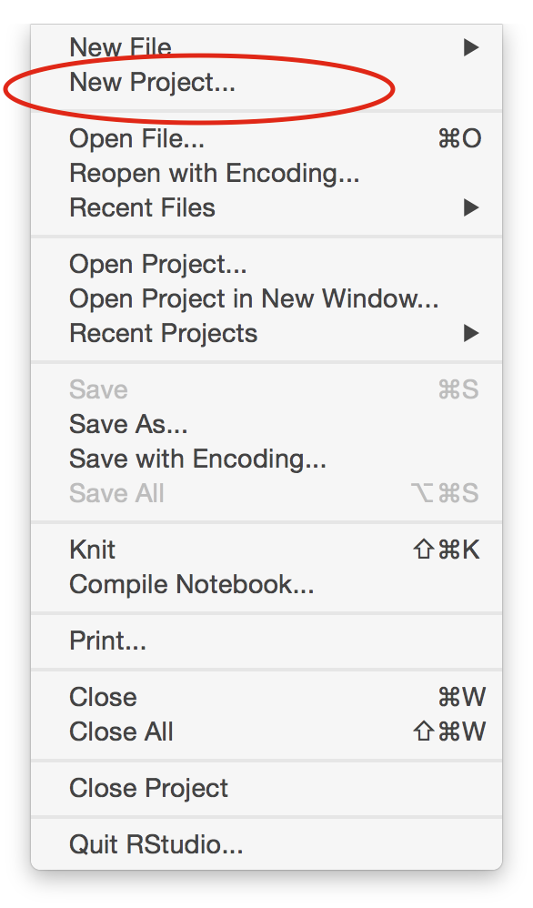
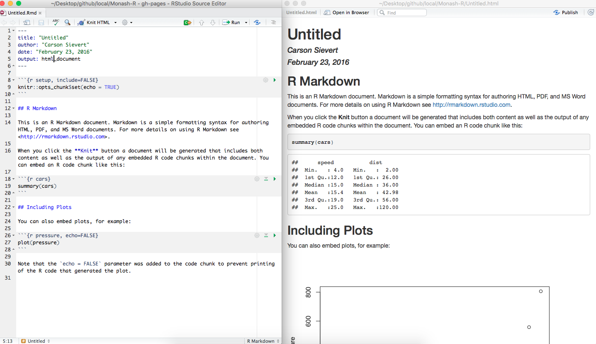

```{r setup, include = FALSE}
library("knitr")
opts_chunk$set(
  message = FALSE,
  warning = FALSE,
  error = FALSE,
  cache = FALSE,
  fig.height = 2,
  fig.width = 5,
  fig.caption = FALSE,
  collapse = TRUE,
  comment = "#>"
)
options(digits=2)
library("rmarkdown")
library("devtools")
library("readr")
library("tidyr")
library("ggplot2")
library("ggthemes")
library("gridExtra")
library("dplyr")
library("lubridate")
library("GGally")
library("rworldmap")
library("ggmap")
library("scales")
library("dichromat")
library("RColorBrewer")
library("viridis")
library("purrr")
library("broom")
library("timeDate")
library("haven")
library("boot")
```

# Outline

- Session 1: Motivation, why and how to think about data, and getting started with R
- Session 2: Making basic plots, grammar of graphics, good practices
- Session 3: Wrangling your data into shape for analysis
- Session 4: Advanced graphics, layering, using maps

# Session 1

**Motivation, why and how to think about data, and getting started with R**

# What is exploratory data analysis?

- EDA is concerned about **letting the data speak**, and discovering what is in the data as opposed to predicting from the data
- Initial data analysis is a part of EDA, where data quality and model assumptions are checked using descriptive statistics, prior to modeling
- EDA complements model building: **"The combination of some data and an aching desire for an answer does not ensure that a reasonable answer can be extracted from a given body of data"** [Tukey, 1986](http://www.jstor.org/pss/2683137).

# Examples

These are two examples of data sets that I've analysed in recent years, and learned a lot by making plots. 

- Education: Every four years students across the globe are tested on their math, reading and science skills and surveyed about their educational experience and social environment, as part of assessing workforce readiness of teenagers.  [http://pisa2012.acer.edu.au](http://pisa2012.acer.edu.au)
- Climate: Monitors and sensors are located across the globe measuring aspects of the environment, e.g. [Scripps Inst. of Oceanography](http://scrippsco2.ucsd.edu/data/atmospheric_co2) 

The data scan be pulled from the web, and the code that produced the plots in these slides is in the `.Rmd` version, so that you can reproduce this work yourself.


# Math Gender Gap


# 

```{r load_data, echo = FALSE, message = FALSE, warning = FALSE, results='hide', cache=FALSE}
student2012.sub <- readRDS("data/student_sub.rds")
```

```{r mapdata, echo = FALSE, message = FALSE, warning = FALSE, results='hide', cache=FALSE}
world <- getMap(resolution = "low")
extractPolys <- function(p) {
  polys <- NULL
  for (i in 1:length(p)) {
    for (j in 1:length(p[[i]]@Polygons)) {
      x <- p[[i]]@Polygons[[j]]@coords
      polys$lon <- c(polys$lon, x[,1])
      polys$lat <- c(polys$lat, x[,2])
      polys$ID <- c(polys$ID, rep(p[[i]]@ID, nrow(x)))
      polys$region <- c(polys$region, rep(paste(p[[i]]@ID, j, sep="_"), nrow(x)))
      polys$order <- c(polys$order, 1:nrow(x))
    }
  }
  return(data.frame(polys))
}
polys <- extractPolys(world@polygons)

# Map theme
theme_map <- theme_bw()
theme_map$line <- element_blank()
theme_map$strip.text <- element_blank()
theme_map$axis.text <- element_blank()
theme_map$plot.title <- element_blank()
theme_map$axis.title <- element_blank()
theme_map$panel.border <- element_rect(colour = "grey90", size=1, fill=NA)
```

```{r dataprep, cache=FALSE, echo = FALSE, message = FALSE, warning = FALSE}
student2012.sub$ST04Q01 <- factor(student2012.sub$ST04Q01, 
  levels=c(1,2), labels=c("Female", "Male"))
```

```{r computemean, cache=FALSE, echo = FALSE, message = FALSE, warning = FALSE, error=FALSE, fig.width=6, fig.height=7}
# Calculate the statistics
student2012.stats <- student2012.sub %>% 
  group_by(CNT) %>%
  summarise(mathgap=mean(PV1MATH[ST04Q01=="Male"], na.rm=T)-
                    mean(PV1MATH[ST04Q01=="Female"], na.rm=T),
            wmathgap=weighted.mean(PV1MATH[ST04Q01=="Male"], 
                                   w=SENWGT_STU[ST04Q01=="Male"], na.rm=T)-
                     weighted.mean(PV1MATH[ST04Q01=="Female"],
                                   w=SENWGT_STU[ST04Q01=="Female"], na.rm=T))

# Compute confidence intervals
cifn <- function(d, i) {
  x <- d[i,]
  ci <- weighted.mean(x$PV1MATH[x$ST04Q01=="Male"], 
                                   w=x$SENWGT_STU[x$ST04Q01=="Male"], na.rm=T)-
                     weighted.mean(x$PV1MATH[x$ST04Q01=="Female"],
                                   w=x$SENWGT_STU[x$ST04Q01=="Female"], na.rm=T)
  ci
}
bootfn <- function(d) {
  r <- boot(d, statistic=cifn, R=100)
  l <- sort(r$t)[5]
  u <- sort(r$t)[95]
  ci <- c(l, u)
  return(ci)
}
#student2012.sub.summary.gap.boot <- ddply(student2012.sub, .(CNT), bootfn)
student2012.sub.summary.gap.boot <- student2012.sub %>% 
  split(.$CNT) %>% purrr::map(bootfn) %>% data.frame() %>%
  gather(CNT, value)
student2012.sub.summary.gap.boot$ci <- 
  rep(c("ml","mu"), length(unique(student2012.sub.summary.gap.boot$CNT)))
student2012.sub.summary.gap.boot.wide <- student2012.sub.summary.gap.boot %>% spread(ci, value)
student2012.sub.summary.gap <- merge(student2012.stats, student2012.sub.summary.gap.boot.wide)

# Match three digit codes to country names 
student2012.sub.summary.gap$name <- NA
for (i in 1:length(student2012.sub.summary.gap$name))  
  student2012.sub.summary.gap$name[i] <-
  isoToName(as.character(student2012.sub.summary.gap$CNT[i]))
# QCN is Shanghai, not whole of China - Don't know what country TAP is
student2012.sub.summary.gap$name[student2012.sub.summary.gap$CNT == "QCN"] <- isoToName("CHN")
student2012.sub.summary.gap$name[student2012.sub.summary.gap$CNT == "TAP"] <- "TAP"

# Make a categorical gap variable
#student2012.sub.summary.gap <-  student2012.sub.summary.gap %>% 
#  mutate(wmathgap_cat = cut(wmathgap, breaks=c(-10,-5, 5, 30), 
#                            labels=c("girls", "same", "boys")))
student2012.sub.summary.gap$wmathgap_cat <- "same"
student2012.sub.summary.gap$wmathgap_cat[student2012.sub.summary.gap$ml > 0] <- "boys"
student2012.sub.summary.gap$wmathgap_cat[student2012.sub.summary.gap$mu < 0] <- "girls"

# Set order of countries by math gap
student2012.sub.summary.gap$CNT <- factor(student2012.sub.summary.gap$CNT, 
      levels=student2012.sub.summary.gap$CNT[order(student2012.sub.summary.gap$wmathgap)])
student2012.sub.summary.gap$name <- factor(student2012.sub.summary.gap$name, 
      levels=student2012.sub.summary.gap$name[order(student2012.sub.summary.gap$wmathgap)])

# Plot
ggplot(data=student2012.sub.summary.gap) + 
  geom_hline(yintercept=0, colour="grey80") + coord_flip() + theme_bw() + 
  geom_point(aes(x=name, y=wmathgap, color=wmathgap_cat), size=3) + 
  geom_segment(aes(x=name, xend=name, y=ml, yend=mu, color=wmathgap_cat)) + 
  xlab("") +  
  scale_colour_manual("", values=c("boys"="skyblue", "girls"="pink", "same"="lightgreen")) +
  scale_y_continuous("Girls <----------> Boys", breaks=seq(-30, 30, 10), limits=c(-35, 35), 
                     labels=c(seq(30, 0, -10), seq(10, 30, 10))) + 
  theme(axis.text.x = element_text(size=5), axis.text.y = element_text(size=5), 
        axis.title = element_text(size=7), legend.text = element_text(size=5),
        legend.title = element_text(size=5))
```

#

```{r maps, cache=FALSE, echo = FALSE, message = FALSE, warning = FALSE, fig.width=8, fig.height=4}
polys <- polys %>% rename(name = ID)
student2012.sub.map <- left_join(student2012.sub.summary.gap, polys)
student2012.sub.map <- student2012.sub.map %>% arrange(region, order)

ggplot(data=polys) + 
  geom_path(aes(x=lon, y=lat, group=region, order=order), colour=I("grey90"), size=0.1) + 
  geom_polygon(data=student2012.sub.map, aes(x=lon, y=lat, group=region, order=order,  fill=wmathgap_cat)) +
  scale_fill_manual("Diff>5", values=c("boys"="skyblue", "girls"="pink", "same"="lightgreen")) + 
  scale_x_continuous(expand=c(0,0)) + scale_y_continuous(expand=c(0,0)) +
  coord_equal() + theme_map 
```


# What's the deal about carbon dioxide?


#

- "Scientific consensus states that carbon emissions must be reduced by 80% by 2050 to avoid temperature rise of more than 2$^o$C." [Carbon Neutral](http://www.carbonneutral.com/resource-hub/carbon-offsetting-explained)
- Carbon offsets: Carbon offsetting is the use of carbon credits to enable businesses to compensate for their emissions.
- Kyoto protocol in 1992, attempt to get international cooperation to reduce emissions. 

# Carbon dioxide data

- Data is collected at a number of locations world wide. 
- See [Scripps Inst. of Oceanography](http://scrippsco2.ucsd.edu/data/atmospheric_co2) 
- Let's pull the data from the web and take a look ...
- 
- Recordings from South Pole (SPO), Kermadec Islands (KER), Mauna Loa Hawaii (MLF), La Jolla Pier, California (LJO), Point Barrow, Alaska (PTB).

#

```{r CO2, fig.width=10, fig.height=5, warning=FALSE, message=FALSE, echo=FALSE, cache=FALSE}
CO2.ptb<-read.table("http://scrippsco2.ucsd.edu/sites/default/files/data/flask_co2_and_isotopic/daily_co2/fldav_ptb.csv", sep=",", skip=69)
colnames(CO2.ptb)<-c("date", "time", "day", "decdate", "n", "flg", "co2")
CO2.ptb$lat<-71.3
CO2.ptb$lon<-(-156.6)
CO2.ptb$stn<-"ptb"

CO2.ljo<-read.table("http://scrippsco2.ucsd.edu/sites/default/files/data/flask_co2_and_isotopic/daily_co2/fldav_ljo.csv", sep=",", skip=69)
colnames(CO2.ljo)<-c("date", "time", "day", "decdate", "n", "flg", "co2")
CO2.ljo$lat<-32.9
CO2.ljo$lon<-(-117.3)
CO2.ljo$stn<-"ljo"

CO2.mlf<-read.table("http://scrippsco2.ucsd.edu/sites/default/files/data/flask_co2_and_isotopic/daily_co2/fldav_mlf.csv", sep=",", skip=69)
colnames(CO2.mlf)<-c("date", "time", "day", "decdate", "n", "flg", "co2")
CO2.mlf$lat<-19.5
CO2.mlf$lon<-(-155.6)
CO2.mlf$stn<-"mlf"

CO2.spo<-read.table("http://scrippsco2.ucsd.edu/sites/default/files/data/flask_co2_and_isotopic/daily_co2/fldav_spo.csv", sep=",", skip=69)
colnames(CO2.spo)<-c("date", "time", "day", "decdate", "n", "flg", "co2")
CO2.spo$lat<- (-90.0)
CO2.spo$lon<-0
CO2.spo$stn<-"spo"

CO2.ker<-read.table("http://scrippsco2.ucsd.edu/sites/default/files/data/flask_co2_and_isotopic/daily_co2/fldav_ker.csv", sep=",", skip=69)
colnames(CO2.ker)<-c("date", "time", "day", "decdate", "n", "flg", "co2")
CO2.ker$lat<-(-29.2)
CO2.ker$lon<-(-177.9)
CO2.ker$stn<-"ker"

CO2.all<-rbind(CO2.ker,CO2.ljo,CO2.mlf,CO2.ptb,CO2.spo)
CO2.all$date<-as.Date(CO2.all$date)

CO2.all$invlat=-1*CO2.all$lat
CO2.all$stn=reorder(CO2.all$stn,CO2.all$invlat)

CO2.all.loc <- rbind(CO2.ker[1,],CO2.ljo[1,],CO2.mlf[1,],CO2.ptb[1,],CO2.spo[1,])

p1 <- qplot(date, co2, data=subset(CO2.all, flg < 2), colour=stn, geom="line",xlab="Year",ylab="CO2 (ppm)") + 
		facet_wrap(~stn, ncol=1) + theme(axis.text.y=element_text(size = 6), legend.position="none")
p2 <- qplot(date, co2, data=subset(CO2.all, flg < 2), colour=stn, geom="line",xlab="Year",ylab="CO2 (ppm)") + 
  theme(axis.text.y=element_text(size = 6), legend.position="none")
grid.arrange(p1, p2, ncol=2)
```

# 

```{r CO2-locations, fig.width=10, fig.height=5, warning=FALSE, message=FALSE, echo=FALSE, cache=FALSE}
ggplot(data=polys) + 
  geom_path(aes(x=lon, y=lat, group=region, order=order), colour=I("grey90"), size=0.1) + 
  geom_point(data=CO2.all.loc, aes(x=lon, y=lat, group=1), colour="red", 
                      size=2, alpha=0) +
  geom_text(data=CO2.all.loc, aes(x=lon, y=lat, label=stn, group=1), 
            colour="orange", size=5) +
  coord_equal() + theme_map 
```

# What do we learn?

- CO$_2$ is increasing, and it looks like it is exponential increase. **I really expected that the concentration would have flattened out with all of the efforts to reduce carbon emissions.**
- The same trend is seen at every location - REALLY? Need some physics to understand this.
- Some stations show seasonal pattern - actually the more north the more seasonality - WHY?

# These slides

- This is a "live" document
- Code and explanations together
- Run the software to make the calculations on the data, and produce nice presentation, or Word or pdf or html document

(Slides and material for this workshop can be found at [http://dicook.github.io/ICSRR](http://dicook.github.io/ISCRR).)

# Why R?

**"R has become the most popular language for data science and an essential tool for Finance and analytics-driven companies such as Google, Facebook, and LinkedIn."** [Microsoft 2015](http://www.revolutionanalytics.com/what-r)


# R is ...

* __Free__ to use
* __Extensible__ Over 7300 user contributed add-on packages currently on `CRAN`! More than 10000 on `github.com`
* __Powerful__ With the right tools, get more work done, faster.
* __Flexible__ Not a question of _can_, but _how_.
* __Frustrating__ Flexibility comes at a cost 

```{r, eval = FALSE, echo = FALSE}
# devtools::install_github("metacran/crandb")
# pkgs <- crandb::list_packages(limit = 999999)
# length(pkgs)
# [1] 7330
```

# R does ...

* __Graphics, statistics, machine learning, etc.__
* __Data acquisition, munging, management__
* __Literate programming (dynamic reports)__
* __Web applications__

# RStudio is ...

[From Julie Lowndes](http://jules32.github.io/resources/RStudio_intro/):

*If R were an airplane, RStudio would be the airport, providing many, many supporting services that make it easier for you, the pilot, to take off and go to awesome places. Sure, you can fly an airplane without an airport, but having those runways and supporting infrastructure is a game-changer.*

# The RStudio IDE

- Source editor: (1) Docking station for multiple files, (2) Useful shortcuts ("Knit"),     (3) Highlighting/Tab-completion, (4) Code-checking (R, HTML, JS), (5) Debugging features
-  Console window: (1) Highlighting/Tab-completion, (2) Search recent commands
- Other tabs/panes:  (1) Graphics,  (2) R documentation, (3) Environment pane,   (4) File system navigation/access,  (5) Tools for package development, git, etc

# Data analysis cycle


(Diagram from [Hadley Wickham](https://github.com/rstudio/RStartHere))

# Let's get started...

Create a project to contain all of the material covered in this set of tutorials:

* File -> New Project -> New Directory -> Empty Project



* Why? 

# Hello R Markdown!

* File -> New File -> R Markdown -> OK -> Knit HTML



* Why?

# What is R Markdown?

- From the [R Markdown home page](http://rmarkdown.rstudio.com/):

*R Markdown is an authoring format that enables easy creation of dynamic documents, presentations, and reports from R. It combines the core syntax of __markdown__ (an easy-to-write plain text format) __with embedded R code chunks__ that are run so their output can be included in the final document. R Markdown documents are fully reproducible (they can be automatically regenerated whenever underlying R code or data changes).*

- RStudio's **[cheatsheet](https://www.rstudio.com/wp-content/uploads/2015/02/rmarkdown-cheatsheet.pdf)** gives a nice, concise overview of its capabilities.

- RStudio's **[reference guide](https://www.rstudio.com/wp-content/uploads/2015/03/rmarkdown-reference.pdf)** lists its options.

# Your turn

Clear the code from the R markdown document, then as work through the **Your turn**s you can add your code blocks and document your answers. The end result will be nicely organised work.

# Reading data

- I primarily use the `readr` package for reading data now. It mimics the base R reading functions but is implemented in C so reads large files quickly, and it also attempts to identify the types of variables.

- For many of the your turns, we will use data pulled from the
[State of New York, Assembled Workers' Compensation Claims: Beginning 2000](http://catalog.data.gov/dataset/assembled-workers-compensation-claims-beginning-2000) which is provided publicly by [data.gov](http:/data.gov).

```{r}
workers <- read_csv(file="data/Assembled_Workers__Compensation_Claims___Beginning_2000.csv", n_max=50)
dim(workers)
colnames(workers)
typeof(workers$`Claim Identifier`)
typeof(workers$`Claim Type`)
```

# Some Basics

* Assign values to a name with `<-` is called **gets**
* `n_max=50` option to the `read_csv` function reads just the first 50 lines
* `dim` reports the dimensions of the data matrix
* `colnames` shows the column names (you can see these by looking at the object in the RStudio environment window, too)
* `$` specify the column to use
* `typeof` indicates the information format in the column, what R thinks
* complex variable names containing spaces, etc, can be used, as long as they are wrapped in single quotes `workers$`Claim Type` `

# Data types

* `list`'s are heterogenous (elements can have different types)
* `data.frame`'s are heterogeneous but elements have same length
* `vector`'s and `matrix`'s are homogenous (elements have the same type)
    * That's why `c(1, "2")` ends up being a character string.
* `function`'s can be written to save repeating code again and again    

* If you'd like to know more, see Hadley Wickham's online chapters on [data structures](http://adv-r.had.co.nz/Data-structures.html) and [subsetting](http://adv-r.had.co.nz/Subsetting.html)

# Operations

* Use built-in _vectorized_ functions to avoid loops

```{r}
set.seed(1000)
x <- rnorm(4)
x
sum(x + 10)
```

* `R` has rich support for documentation, see `?sum`

#

* Use `[` to extract elements of a vector.

```{r}
x[1]
x[c(T, F, T, T, F, F)]
```

#

* Extract _named_ elements with `$`, `[[`, and/or `[`

```{r}
x <- list(
  a = 10,
  b = c(1, "2")
)
x$a
x[["a"]]
x["a"]
```

# Examining 'structure'

* `str()` is probably my favorite `R` function. It shows you the "structure" of _any_ R object (and _everything_ in R is an object!!!)

```{r}
str(x)
```

# Missing values

* `NA` is the indicator of a missing value in R
* Most functions have options for handling missings

```{r}
mean(workers$`Birth Year`)
mean(workers$`Birth Year`, na.rm=TRUE)
```

# Counting categories

* the `table` function can be used to tabulate numbers

```{r}
table(workers$Gender)
table(workers$Gender, workers$`Zip Code`)
```

# Getting Help

* Reading documentation only gets you so far. What about _finding_ function(s) and/or package(s) to help solve a problem???

* Google! (I usually prefix "CRAN" to my search; others might suggest [http://www.rseek.org/](http://www.rseek.org/)

* Ask your question on a relevant StackExchange outlet such as  [http://stackoverflow.com/](http://stackoverflow.com/) or [http://stats.stackexchange.com/](http://stats.stackexchange.com/)

* It's becoming more and more popular to bundle "vignettes" with a package (__dplyr__ has _awesome_ vignettes)

```{r, eval = FALSE}
browseVignettes("dplyr")
```

# Some Oddities

* Yes, `+` is a function (which calls compiled C code)

```{r}
`+`
```

* What's that? You don't like addition? Me neither!

```{r}
"+" <- function(x, y) "I forgot how to add"
1 + 2
```

* But seriously, don't "overload operators" unless you know what you're doing

```{r}
rm("+")
```


# Your Turn

1. Read in the first 1000 lines of the NY workers compensation data
2. Tabulate the Claim Types
3. Compute the average and standard deviation of the birth years
4. How many missing values does `Birth Year` have?

```{r eval=FALSE, echo=FALSE}
workers <- read_csv(file="data/Assembled_Workers__Compensation_Claims___Beginning_2000.csv", n_max=1000)
table(workers$`Claim Type`)
mean(workers$`Birth Year`, na.rm=TRUE)
sd(workers$`Birth Year`, na.rm=TRUE)
summary(workers$`Birth Year`)
```

# Credits

Notes prepared by Di Cook, building on joint workshops with Carson Sievert, Heike Hofmann, Eric Hare, Hadley Wickham.
